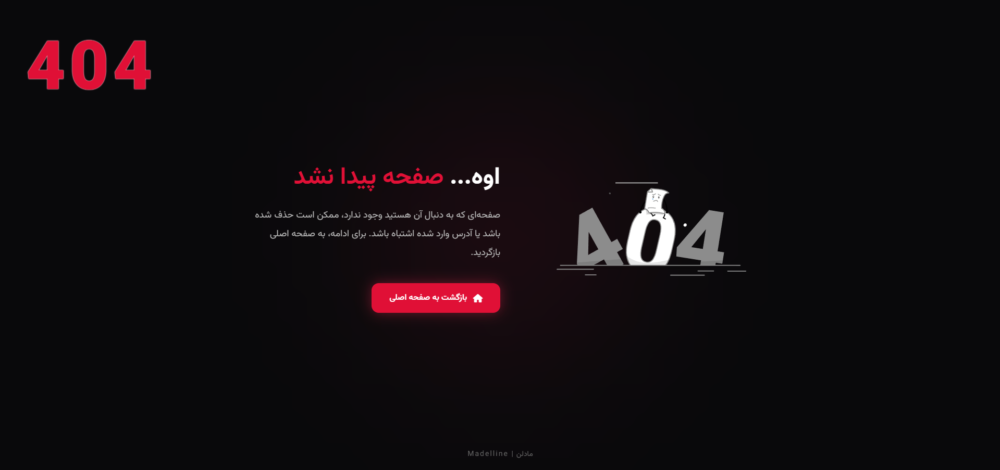

# 🔴 صفحه 404 فارسی

یک صفحه **404 حرفه‌ای، مدرن و ریسپانسیو** با پشتیبانی کامل از زبان فارسی و راست‌چین (RTL)، طراحی شده با تم **Dark / Red** و انیمیشن Lottie.

این پروژه برای استفاده در وب‌سایت‌های شخصی، پروژه‌های تجاری، داشبوردها و سایر پروژه‌های وب مناسب است.

---

## 📸 پیش‌نمایش



---

## ✨ ویژگی‌ها

* 🎨 طراحی مدرن و مینیمال
* 🌙 رابط کاربری Dark
* 🔴 تم رنگی Red / Dark
* 🇮🇷 پشتیبانی کامل از زبان فارسی
* ↔️ پشتیبانی از RTL
* 📱 کاملاً Responsive
* 🎞️ انیمیشن Lottie
* ✨ افکت Glow و انیمیشن پس‌زمینه
* 🖱️ افکت Hover روی دکمه
* 🔢 نمایش بزرگ کد خطای `404`
* 🏠 دکمه بازگشت به صفحه اصلی
* ⚡ بدون نیاز به Framework
* 📄 تمام کدها در یک فایل HTML
* 🔍 دارای تنظیمات `noindex, nofollow` برای صفحه خطا

---

## 🛠️ تکنولوژی‌های استفاده‌شده

این پروژه با تکنولوژی‌های ساده و سبک وب ساخته شده است:

| تکنولوژی     | کاربرد                        |
| ------------ | ----------------------------- |
| HTML5        | ساختار صفحه                   |
| CSS3         | طراحی، Responsive و Animation |
| Font Awesome | آیکون‌ها                      |
| Vazirmatn    | فونت فارسی                    |
| Lottie       | انیمیشن صفحه                  |

---

## 📁 ساختار پروژه

```text
404-Page/
│
├── 404.html
├── desktop.png
└── README.md
```

---

## 🚀 استفاده

برای استفاده از این صفحه کافی است فایل `404.html` را در پروژه خود قرار دهید.

### Apache

اگر از Apache استفاده می‌کنید، می‌توانید در فایل `.htaccess` این تنظیم را اضافه کنید:

```apache
ErrorDocument 404 /404.html
```

بعد از آن، زمانی که کاربر وارد یک آدرس نامعتبر شود، صفحه `404.html` نمایش داده خواهد شد.

---

## 🎨 شخصی‌سازی

### تغییر نام وب‌سایت

در انتهای فایل `404.html` می‌توانید نام پیش‌فرض وب‌سایت را تغییر دهید:

```html
<div class="footer">
    نام وبسایت | Website Name
</div>
```

مثلاً:

```html
<div class="footer">
    MTA Company | Web Development
</div>
```

---

### تغییر لینک صفحه اصلی

دکمه بازگشت به صفحه اصلی به صورت پیش‌فرض به مسیر `/` متصل است:

```html
<a href="/" class="btn">
```

در صورت نیاز می‌توانید مسیر آن را تغییر دهید.

---

### تغییر رنگ اصلی

رنگ اصلی صفحه در CSS استفاده شده است. رنگ قرمز فعلی:

```css
#e01036
```

است.

می‌توانید آن را متناسب با رنگ‌بندی وب‌سایت خود تغییر دهید.

---

## 📱 طراحی واکنش‌گرا

صفحه برای نمایش در اندازه‌های مختلف طراحی شده است.

در نمایشگرهای کوچک‌تر از `900px`، ساختار صفحه از حالت افقی به عمودی تغییر می‌کند و اندازه انیمیشن و متن نیز کاهش پیدا می‌کند.

```css
@media (max-width: 900px) {
    .container {
        flex-direction: column;
    }
}
```

بنابراین صفحه در:

* 💻 دسکتاپ
* 💻 لپ‌تاپ
* 📱 موبایل
* 📟 تبلت

قابل استفاده است.

---

## 🎞️ انیمیشن

برای نمایش انیمیشن از **Lottie Player** استفاده شده است.

انیمیشن به صورت خودکار اجرا می‌شود و در حالت Loop قرار دارد:

```html
<lottie-player
    src="https://assets10.lottiefiles.com/packages/lf20_kcsr6fcp.json"
    background="transparent"
    speed="1"
    loop
    autoplay>
</lottie-player>
```

---

## ⚙️ وابستگی‌ها

این پروژه به صورت مستقل به Frameworkهایی مانند:

* Bootstrap
* Tailwind CSS
* React
* Vue
* Angular

وابسته نیست.

تنها منابع خارجی استفاده‌شده شامل **Vazirmatn، Font Awesome و Lottie Player** هستند.

---

## 🌐 مناسب برای

این صفحه 404 می‌تواند در انواع پروژه‌ها استفاده شود:

* 👨‍💻 وب‌سایت شخصی
* 💼 وب‌سایت شرکتی
* 🛒 فروشگاه اینترنتی
* 📊 داشبورد
* 🚀 Landing Page
* 🧑‍💻 Portfolio
* 🔧 پروژه‌های Front-End
* 🌐 وب‌سایت‌های فارسی

---

## 📌 نکته

صفحه دارای تگ زیر است:

```html
<meta name="robots" content="noindex, nofollow">
```

بنابراین موتورهای جستجو از ایندکس کردن صفحه 404 جلوگیری می‌کنند؛ رفتاری که برای صفحات خطای 404 معمولاً مناسب است.

---

## 📄 مجوز

این پروژه برای استفاده و شخصی‌سازی در پروژه‌های مختلف ارائه شده است.

در صورت استفاده یا توسعه پروژه، خوشحال می‌شوم تغییرات و نسخه‌های جدید را با جامعه توسعه‌دهندگان به اشتراک بگذارید.


⭐ اگر این پروژه برای شما مفید بود، خوشحال می‌شوم با یک **Star ⭐** از پروژه حمایت کنید.
